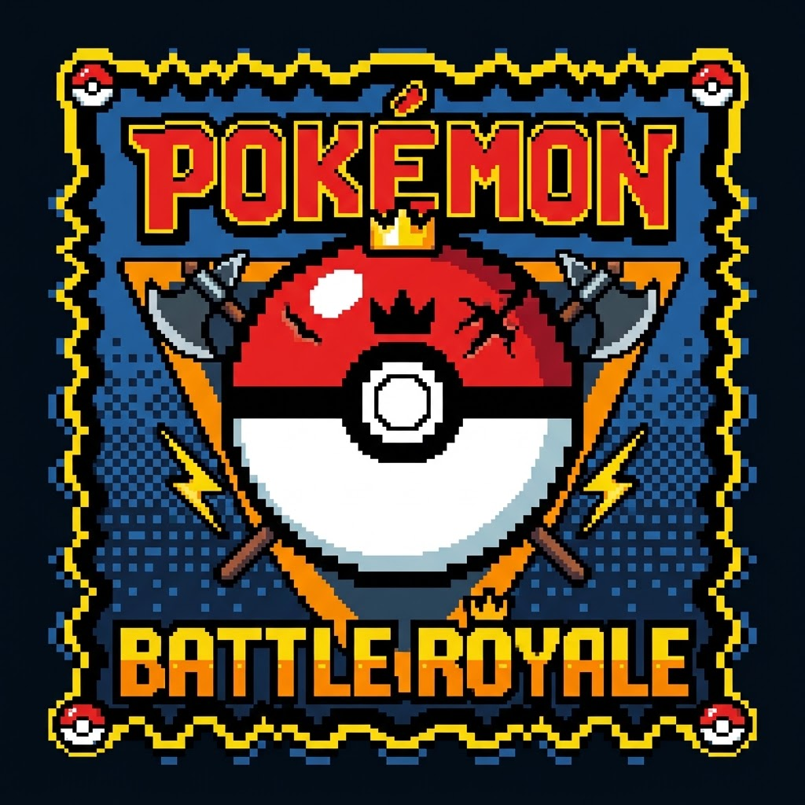

<p align="center">
  
</p>

<h1 align="center">Kanto Battle Royale</h1>

<p align="center">
  <a href="../../releases/latest"></a>
  <a href="../../releases"></a>
  <a href="https://github.com/bryanthaboi/gen1recomp"></a>
  <a href="https://campavao.github.io/kanto-battle-royale/"></a>
  <a href="../../actions/workflows/relay-stats.yml"></a>
  <a href="LICENSE"></a>
</p>

<p align="center">
  <a href="../../releases/latest"><b>Download</b></a> ·
  <a href="#install">Install</a> ·
  <a href="#how-the-game-plays">How it plays</a> ·
  <a href="https://campavao.github.io/kanto-battle-royale/">Live stats</a> ·
  <a href="COMPATIBILITY.md">Compatibility</a>
</p>

Prove you're the very best, like no one ever was, in the Kanto Battle Royale!

Play with up to 30 other players at one time, dropping all over Kanto, to be the last one standing. Build up a strong team, avoid Weezing's Fog, and play it cool in ways Satoshi couldn't have imagined in this easy to install [gen1recomp](https://github.com/bryanthaboi/gen1recomp) mod! 

## Install

1. **[Download the latest release zip](../../releases/latest)**
2. Open [gen1recomp](https://github.com/bryanthaboi/gen1recomp), go to Mods, and import downloaded Battle Royale zip file.
    - If the download is not a `.zip` file when you download, compress first and then import
4. Launch the game. `BATTLE ROYALE` is on the title menu.

> **This mod needs gen1recomp v0.2.26 or newer.**
> Everyone in a match needs the same game and mod version — [why that is](COMPATIBILITY.md).

## Screenshots

|  |  |  |
| :--------: | :--------: | :--------: |
| Start screen   | Unlock skins   | Catch what you can in the Safari   |
| Choose where to drop   | Where the fog is closing in on   | Pick up fallen trainer's Pokemon   |  
| Don't get caught in the fog!   | Game stats   | Spectate others 
  | See fog on the map   | 

## Getting started

Here are the available options:
1. **Quick Play**
    - Creates a game if none are available, or joins an open game
    - Picks the fullest room available to join
    - Game auto-starts after a while
2. **Daily Game**
    - One official match a day, at a set time - the lobby shows the countdown
    - Everyone who presses it lands in the same room, and it starts on the clock whether or not anyone presses anything
    - Fills to 30 trainers with bots and runs on the stock Fog and Safari clocks, so it's the same game for everyone
    - Press it while the day's match is running and you can watch it and play the next one
3. **Solo VS Bots**
    - Solo game which fills the game with bots, up to 30
4. **Host Game**
    - Creates a game with a code that you can invite others to
    - If you enable the option "OPEN" to "YES" then players will be able to join via Quick Play
5. **Join By Code**
    - Allows you to join a game if you know the code
6. **Name**
    - This is your name! It's what shows up in game
7. **Skin**
    - This is your Sprite. Default is RED. You can unlock more as you keep winning.
8. **Server...**
    - I have a dedicated host right now, but you can load up your own server and direct your client via updating this setting.

Info on each game settings can be seen down in the Game lobby options section down below.

## How the game plays

1. **Everyone starts in the Safari**
    - You get a set amount of time to try and catch as many Pokemon as you can
    - Pokemon in the Safari are on a randomized pool
    - If you don't catch any Pokemon before the time runs out, you're out!
2. **Pick where you're dropping**
    - Choose any of the towns to go to after the Safari
    - One town will be at the center of the **Weezing Fog**
3. **Weezing Fog**
    - Over time fog will cover Kanto, circling on one city/town
    - Location is randomized every game
    - You don't know the location until after you drop
    - Fog will hurt all your Pokemon over time
    - Once the fog starts, the Pokemon Center closes
        - Heal up early, while you still can
        - The nurse is open for the whole grace period before the first ring
4. **Fight to be the last one standing**
    - Last player standing wins!
    - Every win helps you unlock a new Sprite
    - If you white out, you lose
5. **Spectating**
    - After whiting out, you go into Spectator mode
    - Use Left and Right buttons to swap between Players (or bots)
  
## Tips

- **Catch em all**
  - Fight other trainers and they'll drop their Pokemon for you to collect
  - Fighting other players (and bots) will also drop their bag
  - You can only have a max of 6 Pokemon
  - At 6/6 you pick who to drop, and whoever you drop lands as a ball for
    someone else to grab
  - Same goes for Pokemon handed to you in a ball (the Fighting Dojo prize,
    the Silph Lapras, the Celadon Eevee, revived fossils) - they follow the
    same rule instead of disappearing into the PC
  - Battle Gym Leaders to get special Pokemon OR go find and catch Legendaries before someone else
- **Watch for the bubble over someone's head**
  - A "?" means they're sitting in a menu
  - A "!" means they're already in a fight, so they can't answer you
  - Everyone can see them, so yours is showing too
- **You start with all HMs**
  - Catch a Flying type early to have access to Fly, or a Water type for Surf
  - Meant to help you get around Kanto a bit easier, if you have the right Pokemon
- **TMs and HMs are named after the move they teach**
  - TM19 shows up as "SEISMIC TOSS", HM01 as "CUT"
  - Works everywhere the item name shows: your bag, loot on the ground, a
    beaten trainer's bag
  - Only during a match - outside one they go back to TM01, TM02 and so on
- **Apply Moves from the Pokemon screen**
  - Only available outside of battle
  - Swap your Pokemon's moves at any time to be any they can learn
  - Can learn better moves as the game goes on
  - Will automatically include applicable HMs and TMs you have in your bag
  

### Game lobby options

The lobby is the room itself: everyone in it as their Sprite with their name, and the room code up top to share. The host gets an **OPTIONS** button, everyone else gets **LEAVE**. Press A on a trainer to see their card (name, wins) - the host can **REMOVE** them from there.

- Fill
  - Two options: ON or OFF
  - If ON, bots take any empty seats when the match starts
  - If OFF, the match is exactly who's in the room
- Max
  - How many can be in the room: 2, 4, 6, 8, 12, 16, 20, 26 or 30
  - Nobody can join past it, so a game with friends stays a game with friends
  - In Solo VS Bots it's how many bots you fight
  - The relay seats 16 humans at most; the rest of the seats are bots
- Open
  - Two options: NO (default) or YES
  - If YES, allows players to join from Quick Play option
- Fog
  - Control how long it takes before the Fog rolls in
- Safari
  - Control how long the Safari intro is
- Match Options
  - Text: FAST, MEDIUM or SLOW
  - Animation: ON or OFF
  - What the host picks is what everyone in the match plays at, so nobody is a page behind in a fight
  - Remembered between games - Revert To Default puts the game's own settings back (MEDIUM, ON)
  - Debug: ON or OFF (for nerds) - turns on the deep log, and only on your machine
  - Solo and hosted games only - Quick Play and the Daily Game always run at the defaults
- Start Match
  - Starts the match!
  - When starting a game via "Quick Play" this kicks off automatically
  - After a match it reads Play Again and runs the same room back
- Leave
  - Back out of the menu

Send Stats moved out of the lobby: it's in the gen1recomp launcher under Mods, in Battle Royale's options - see "What gets sent" below.

## What gets sent

Short version: how many matches get played, and nothing about you.

- **What rides along** the next time you host, join, or Quick Play
  - A random ID made up on your machine the first time
  - The mod version
  - How many solo matches since it last reported
  - The date you first played
- **What doesn't**
  - Your trainer name
  - Anything about your save, your team, or where you've been
  - Your IP
- **It never dials out on its own**
  - Solo stays offline, so playing with no wifi works like it always did
  - Only play solo? Nothing is counted until the first time you go online
- **Don't want it?**
  - `SEND STATS: OFF` in the launcher, under Mods → Battle Royale's options
  - Off stops the counting as well as the sending

You can see what it adds up to on the [live stats page](https://campavao.github.io/kanto-battle-royale/).

## Running your own relay (for the nerds)

Only needed for playing with other people — `SOLO VS BOTS` never touches it. Everyone points `SERVER...` at the same address, and the default one is mine.

```sh
node relay/server.js   # :7790 (PORT or BR_RELAY_PORT to change)
```

- Zero dependencies — Node 18+ and a reachable port is a server
- It's **raw TCP**, not HTTP, so hosts that only forward HTTP (Vercel, Netlify) won't work
- On **Railway**: deploy this repo with **Root Directory `relay`**, set `PORT=7790`, add a **TCP Proxy** to port 7790, and turn **App Sleeping off** — the `host:port` it gives you is what goes under `SERVER...`
- `BR_MAX_ROOMS` (default 40) and `BR_MAX_CONNS` (default 200) cap what it will hold
- It has flood limits but no accounts and no moderation — anyone with the address can open a room

## For developers

The mod is built on the `battle-royale` branch of [campavao/gen1recomp](https://github.com/campavao/gen1recomp/tree/battle-royale/mods/battle_royale), and this repo is a copy of that folder. The [developer README](https://github.com/campavao/gen1recomp/blob/battle-royale/mods/battle_royale/README.md) over there covers how it works, the engine hooks it needs, the test suites, and the scripted playtest drivers. Please open pull requests there, not here — a change merged here is overwritten by the next copy.

## Credits and licence

MIT, and it ships no game data — you supply your own ROM to gen1recomp.
Built on [gen1recomp](https://github.com/bryanthaboi/gen1recomp) by BOIS CLUB
GAMES, LLC.

Pokemon is a trademark of Nintendo / Creatures Inc. / GAME FREAK inc. This
project is not affiliated with or endorsed by them.
